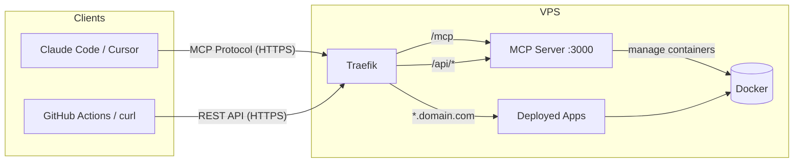

<p align="center">
  
</p>

<h1 align="center">mcp-deploy</h1>

Deploy Docker containers to your VPS from Claude Code, Cursor, or any MCP client. One command to install, one sentence to deploy.

**[Website](https://ddalcu.github.io/mcp-deploy/)** · **[Quick Start](#quick-start)** · **[MCP Tools](#mcp-tools)** · **[REST API](#rest-api)**

<p>
  
  
</p>

> **Demo video:** [Watch the full demo](https://ddalcu.github.io/mcp-deploy/) on the project website.

---

## Table of Contents

- [How It Works](#how-it-works)
- [Quick Start](#quick-start)
- **Usage**
  - [Pushing Images](#pushing-images)
  - [Multiple Servers](#multiple-servers)
  - [MCP Tools](#mcp-tools)
  - [REST API](#rest-api)
  - [GitHub Actions](#github-actions)
  - [Web Dashboard](#web-dashboard)
- **Server**
  - [What Gets Installed](#what-gets-installed-on-your-vps)
  - [Exposure Modes](#mcp-server-exposure-modes)
  - [Configuration](#configuration)
  - [Upgrade](#upgrade) · [Uninstall](#uninstall)
  - [Security](#security)
- **Reference**
  - [Architecture](#architecture)
  - [Development](#development)
  - [How It Compares](#how-it-compares)
  - [Contributing](#contributing)

---

## How It Works

```
┌─────────────────┐       HTTPS        ┌─────────────────────────────────────┐
│  Claude Code /  │ ────────────────── │          Your VPS                   │
│  Cursor / any   │   MCP Protocol     │                                     │
│  MCP Client     │      /mcp          │  Traefik ──→ MCP Server (:3000)     │
└─────────────────┘                    │     │                               │
                                       │     ├──→ my-app.deploy.example.com  │
┌─────────────────┐    HTTP (direct)   │     ├──→ my-api.deploy.example.com  │
│  GitHub Actions │ ────────────────── │     └──→ blog.deploy.example.com    │
│  / CI/CD / curl │   REST API /api    │                                     │
└─────────────────┘                    └─────────────────────────────────────┘
```

- **Traefik** handles SSL (automatic per-subdomain Let's Encrypt certs) and routes each subdomain to the right container
- **MCP Server** receives tool calls over [Streamable HTTP](https://modelcontextprotocol.io/specification/2025-03-26/basic/transports) and manages Docker containers
- **No database** — Docker is the source of truth
- **No registry required** — push images directly or pull from GHCR/DockerHub

---

## Quick Start

### 0. Get a VPS

You need a Linux VPS with a public IP. Any provider works — if you don't have one yet, [Hetzner gives you a $20 credit to get started](https://hetzner.cloud/?ref=4bBAKWKbTCIO). A CX22 (2 vCPU, 4 GB RAM) is more than enough.

> **Note:** Proxmox/LXC Note: If you want to run this on Proxmox/LXC, make sure its in a VM, not LXC.

### 1. Set Up DNS

Create two DNS A records pointing to your VPS IP:

| Record | Type | Value | Purpose |
|--------|------|-------|---------|
| `deploy.example.com` | A | `YOUR_VPS_IP` | MCP server (`mcp.deploy.example.com`) |
| `*.deploy.example.com` | A | `YOUR_VPS_IP` | All deployed apps (`myapp.deploy.example.com`, etc.) |

> **Note:** The wildcard record (`*`) must include the dot and asterisk prefix — enter it exactly as `*.deploy.example.com` in your DNS provider. This is a separate record from the base domain.

### 2. Install on Your VPS

SSH into your server:

```bash
ssh root@your-vps
```

Then run the installer with **curl**:

```bash
curl -fsSL https://raw.githubusercontent.com/ddalcu/mcp-deploy/main/install.sh | bash
```

Or with **wget**:

```bash
wget -qO- https://raw.githubusercontent.com/ddalcu/mcp-deploy/main/install.sh | bash
```

The installer asks for two things: your **base domain** (e.g. `deploy.example.com`, without `*` or leading dot) and **email** (for Let's Encrypt). That's it. It generates an API key and starts everything.

### 3. Add to Your MCP Client

Copy the config the installer outputs into your MCP client settings.

**Claude Code:**

```bash
claude mcp add deploy https://mcp.deploy.example.com/mcp \
  -t http -s user \
  -H "Authorization: Bearer YOUR_API_KEY"
```

The `-s user` flag makes it available in all projects. Restart Claude Code after adding.

### 4. Deploy Something

Open any project in Claude Code and say:

> "Deploy nginx:alpine as hello"

Visit `https://hello.deploy.example.com` — it's live with SSL.

---

## Pushing Images

### Option A: Push directly (no registry needed)

Build locally and send the image straight to your VPS:

```bash
docker build -t my-app:latest .
docker save my-app:latest | curl -X POST -T - \
  -H "Authorization: Bearer YOUR_API_KEY" \
  https://mcp.deploy.example.com/upload
```

Then deploy it:

> "Deploy my-app:latest as my-app on port 3000"

### Option B: Pull from an external registry

Use any registry. Public images just work:

> "Deploy nginx:alpine as docs on port 80"

For private registries, pass credentials:

> "Deploy ghcr.io/myorg/my-app:latest as my-app on port 3000 with registry auth username myuser password ghp_abc123"

---

## Multiple Servers

Install on as many VPS servers as you want. Add each as a separate MCP server entry:

```json
{
  "mcpServers": {
    "deploy-prod": {
      "type": "streamable-http",
      "url": "https://mcp.prod.example.com/mcp",
      "headers": { "Authorization": "Bearer PROD_KEY" }
    },
    "deploy-staging": {
      "type": "streamable-http",
      "url": "https://mcp.staging.example.com/mcp",
      "headers": { "Authorization": "Bearer STAGING_KEY" }
    }
  }
}
```

Then specify which server: *"Deploy my-app to deploy-staging"*

---

## MCP Tools

Nine tools, available to any MCP client — all managed through natural language.

| Tool | Description |
|------|-------------|
| `deploy` | Deploy or redeploy a Docker image with automatic SSL and subdomain routing |
| `deploy-static` | Deploy a static HTML/CSS/JS site — no Docker image needed |
| `list` | List all managed deployments |
| `logs` | Get container logs |
| `status` | Detailed app info — CPU, memory, uptime, restart count |
| `stop` | Stop a running app (container preserved) |
| `start` | Start a stopped app |
| `remove` | Permanently remove an app and its container |
| `upload-image` | Push a locally-built Docker image to your VPS — no registry needed |

### Deploy Parameters

| Param | Type | Required | Description |
|-------|------|----------|-------------|
| `name` | string | yes | App name — becomes the subdomain (`name.domain.com`) |
| `image` | string | yes | Docker image (e.g. `nginx:alpine`, `ghcr.io/user/repo:v1`) |
| `port` | number | no | Port the app listens on inside the container. Auto-detected from the image `EXPOSE` directive if not provided. |
| `env` | object | no | Environment variables (`{ "KEY": "value" }`) |
| `registry_auth` | object | no | `{ "username": "...", "password": "..." }` for private registries |
| `volumes` | string[] | no | Named volume mounts (`["data:/app/data"]`) |
| `command` | string | no | Override the container's default command |

---

## REST API

All MCP tools are also available as standard REST endpoints — no LLM or MCP client required. Use these from GitHub Actions, shell scripts, or any HTTP client.

All endpoints require `Authorization: Bearer YOUR_API_KEY`.

| Method | Path | Description |
|--------|------|-------------|
| `POST` | `/api/deploy` | Deploy or redeploy a Docker image |
| `GET` | `/api/apps` | List all deployed apps |
| `GET` | `/api/apps/:name` | Get detailed app status |
| `GET` | `/api/apps/:name/logs` | Get app logs |
| `POST` | `/api/apps/:name/stop` | Stop an app |
| `POST` | `/api/apps/:name/start` | Start a stopped app |
| `DELETE` | `/api/apps/:name` | Remove an app |
| `POST` | `/upload` | Upload a Docker image (binary stream) |
| `POST` | `/deploy-static/:name` | Deploy a static site (tar.gz) |

### Deploy via REST

```bash
curl -X POST \
  -H "Authorization: Bearer YOUR_API_KEY" \
  -H "Content-Type: application/json" \
  -d '{"name": "my-app", "image": "nginx:alpine", "port": 80}' \
  https://mcp.deploy.example.com/api/deploy
```

Response:

```json
{"name": "my-app", "url": "https://my-app.deploy.example.com", "image": "nginx:alpine", "container": "mcp-deploy-my-app", "status": "running"}
```

### List apps

```bash
curl -H "Authorization: Bearer YOUR_API_KEY" \
  https://mcp.deploy.example.com/api/apps

# Filter: ?status=running or ?status=stopped
```

### App status, logs, stop, start, remove

```bash
# Status
curl -H "Authorization: Bearer $KEY" https://mcp.example.com/api/apps/my-app

# Logs (optional: ?tail=50&since=1h)
curl -H "Authorization: Bearer $KEY" https://mcp.example.com/api/apps/my-app/logs

# Stop
curl -X POST -H "Authorization: Bearer $KEY" https://mcp.example.com/api/apps/my-app/stop

# Start
curl -X POST -H "Authorization: Bearer $KEY" https://mcp.example.com/api/apps/my-app/start

# Remove (optional: ?remove_volumes=true)
curl -X DELETE -H "Authorization: Bearer $KEY" https://mcp.example.com/api/apps/my-app
```

---

## GitHub Actions

For CI/CD, you'll typically push images from a registry rather than uploading directly. Recommended registries:

- **[GitHub Container Registry (GHCR)](https://docs.github.com/en/packages/working-with-a-github-packages-registry/working-with-the-container-registry)** — free for public repos, integrates with GitHub Actions
- **[Docker Hub](https://hub.docker.com/)** — one free private repo, widely supported
- **[ttl.sh](https://ttl.sh/)** — anonymous, ephemeral registry (images expire after hours) — great for previews and testing

### Deploy from a registry (recommended)

```yaml
name: Deploy
on:
  push:
    branches: [main]

jobs:
  deploy:
    runs-on: ubuntu-latest
    steps:
      - uses: actions/checkout@v4

      - name: Login to GHCR
        uses: docker/login-action@v3
        with:
          registry: ghcr.io
          username: ${{ github.actor }}
          password: ${{ secrets.GITHUB_TOKEN }}

      - name: Build and push
        uses: docker/build-push-action@v6
        with:
          push: true
          tags: ghcr.io/${{ github.repository }}:latest

      - name: Deploy to VPS
        run: |
          curl -fsSL -X POST \
            -H "Authorization: Bearer ${{ secrets.DEPLOY_KEY }}" \
            -H "Content-Type: application/json" \
            -d '{
              "name": "my-app",
              "image": "ghcr.io/${{ github.repository }}:latest",
              "port": 3000,
              "registry_auth": {
                "username": "${{ github.actor }}",
                "password": "${{ secrets.GITHUB_TOKEN }}"
              }
            }' \
            https://mcp.${{ secrets.DEPLOY_DOMAIN }}/api/deploy
```

### Deploy with direct image upload (no registry)

If you prefer not to use a registry, you can upload the image directly. This requires [direct port access](#mcp-server-exposure-modes) for best results.

```yaml
      - name: Build and upload image
        run: |
          docker build -t my-app:latest .
          docker save my-app:latest | curl -fsSL -X POST -T - \
            -H "Authorization: Bearer ${{ secrets.DEPLOY_KEY }}" \
            http://${{ secrets.VPS_IP }}:8080/upload

      - name: Deploy
        run: |
          curl -fsSL -X POST \
            -H "Authorization: Bearer ${{ secrets.DEPLOY_KEY }}" \
            -H "Content-Type: application/json" \
            -d '{"name": "my-app", "image": "my-app:latest", "port": 3000}' \
            http://${{ secrets.VPS_IP }}:8080/api/deploy
```

### Deploy a static site

```yaml
      - name: Deploy static site
        run: |
          tar -czf site.tar.gz -C ./dist .
          curl -fsSL -X POST \
            -H "Authorization: Bearer ${{ secrets.DEPLOY_KEY }}" \
            -H "Content-Type: application/gzip" \
            --data-binary @site.tar.gz \
            https://mcp.${{ secrets.DEPLOY_DOMAIN }}/deploy-static/my-site
```

---

## Web Dashboard

The server includes a built-in web dashboard at the root URL (`/`). It shows all deployed apps with their status, resource usage, and logs — no MCP client required.

- **Auth**: enter your API key to log in (saved in `localStorage`)
- **App table**: name, status (green/red badge), image, URL, CPU, memory
- **Logs**: click any row to expand and view the last 50 log lines
- **Auto-refresh**: polls every 30 seconds
- **Dark theme**, no external dependencies, works on mobile

Access it at `https://mcp.deploy.example.com` (production) or `http://localhost:3000` (local dev).

---

## What Gets Installed on Your VPS

```
/opt/mcp-deploy/
├── .env                  ← your config + API key (chmod 600)
└── docker-compose.yml    ← the stack definition
```

Two files. Everything else runs in Docker:

| Container | Image | Purpose |
|-----------|-------|---------|
| `mcp-deploy-traefik` | `traefik:v3.3` | Reverse proxy + automatic SSL |
| `mcp-deploy-server` | `ghcr.io/ddalcu/mcp-deploy` | MCP server |

Plus a `traefik-certs` volume for Let's Encrypt certificates and a `web` network shared by all containers.

---

## MCP Server Exposure Modes

The installer asks how the MCP server (dashboard, API, MCP endpoint) should be accessible. This only affects the MCP server — deployed apps always use Traefik for subdomain routing.

| Mode | MCP Server access | Deployed apps |
|------|-------------------|---------------|
| **Domain only** *(default)* | `https://mcp.domain.com` via Traefik | Via Traefik |
| **Port only** | `http://IP:PORT` direct access | Via Traefik |
| **Both** | Domain + direct port | Via Traefik |

**Port only** is useful when you have your own reverse proxy in front, or only need API/CI access without a subdomain for the MCP server itself.

To change the mode after installation, edit `/opt/mcp-deploy/.env`:

```bash
# Domain only (default) — remove MCP_TRAEFIK and DIRECT_PORT lines

# Port only
MCP_TRAEFIK=false
DIRECT_PORT=8080

# Both
DIRECT_PORT=8080
```

For **port only** or **both**, create `/opt/mcp-deploy/docker-compose.override.yml`:

```yaml
services:
  mcp-server:
    ports:
      - "${DIRECT_PORT}:3000"
```

Then restart:

```bash
cd /opt/mcp-deploy && docker compose up -d
```

> **Security note:** The direct port is HTTP (not HTTPS). Use it only for server-to-server communication (CI/CD) where the VPS IP is known. All endpoints still require the API key.

---

## Configuration

All config is in `/opt/mcp-deploy/.env` on the VPS:

| Variable | Description | Default |
|----------|-------------|---------|
| `DOMAIN` | Base domain for all services | *(required)* |
| `ACME_EMAIL` | Let's Encrypt notification email | *(required)* |
| `API_KEY` | Bearer token for MCP server auth | *(auto-generated)* |
| `MCP_IMAGE` | Override the MCP server Docker image | `ghcr.io/ddalcu/mcp-deploy:latest` |
| `MCP_TRAEFIK` | Route MCP server through Traefik | `true` |
| `DIRECT_PORT` | Expose MCP server on this port via IP (no SSL) | *(disabled)* |

After editing `.env`, restart the stack:

```bash
cd /opt/mcp-deploy && docker compose up -d
```

---

## Upgrade

```bash
cd /opt/mcp-deploy && docker compose pull && docker compose up -d
```

This pulls the latest MCP server image and recreates the container. Your config (`.env`), deployed apps, and SSL certificates are not affected.

## Uninstall

```bash
cd /opt/mcp-deploy && docker compose down -v
rm -rf /opt/mcp-deploy
docker network rm web
```

---

## Security

- All traffic is HTTPS via Traefik + Let's Encrypt (automatic per-subdomain certs via HTTP-01 challenge)
- MCP and upload endpoints require `Authorization: Bearer <token>` (timing-safe comparison)
- API key is generated with `openssl rand -hex 32` (256-bit)
- `.env` file is `chmod 600` (root-only readable)
- Volume mounts are restricted to named volumes only (no host path mounts)
- Infrastructure container names are reserved and cannot be overwritten via deploy
- Upload endpoint enforces a 2 GB size limit

---

## Architecture



```
server/src/
├── index.ts        ← Express + MCP Streamable HTTP transport + /upload endpoint
├── api.ts          ← REST API router (/api/*) for CI/CD
├── auth.ts         ← Bearer token middleware (timing-safe)
├── config.ts       ← Environment variable config
├── dashboard.ts    ← Web dashboard HTML (served at GET /)
├── docker.ts       ← Dockerode singleton + pull/load/list helpers
├── labels.ts       ← Traefik label generator
├── validation.ts   ← Shared app name validation + reserved names
└── tools/
    ├── deploy.ts   ← Pull or use local image, create container with Traefik labels
    ├── list.ts     ← Query Docker for containers labeled mcp-deploy.managed=true
    ├── logs.ts     ← Container log retrieval
    ├── status.ts   ← Container inspect + live CPU/memory stats
    ├── stop.ts     ← Stop container
    ├── start.ts    ← Start container
    └── remove.ts   ← Stop + remove container
```

**Design principles:**
- Docker IS the database — no SQLite, no JSON state files, no sync issues
- Traefik auto-discovers containers via Docker labels — no config reloads
- Each tool is one file (SRP) — easy to add new tools without touching existing code
- Stateless auth — every request validates independently, no sessions

---

## Development

A local dev compose file runs the full stack (Traefik + MCP server) on your machine with self-signed TLS, source mounting, and live reload. Compatible with Docker, Podman, and OrbStack.

### 1. Add a hosts entry

```bash
# macOS / Linux
echo "127.0.0.1 mcp.mcp.local" | sudo tee -a /etc/hosts
```

For each app you deploy locally, add its subdomain too (e.g. `127.0.0.1 my-app.mcp.local`).

### 2. Start the stack

```bash
git clone https://github.com/ddalcu/mcp-deploy.git
cd mcp-deploy
docker compose -f docker-compose.dev.yml up
```

The startup output shows the dashboard URL and API key:

```
  Dashboard: http://localhost:3000
  API Key:   devkey
```

### 3. Access

| URL | Description |
|-----|-------------|
| `http://localhost:3000` | Direct access (bypasses Traefik) |
| `http://mcp.mcp.local` | Via Traefik (HTTP) |
| `https://mcp.mcp.local` | Via Traefik (HTTPS, accept self-signed cert warning) |

Source files are bind-mounted from `server/src/` — edit and restart the `mcp-deploy-server` container to pick up changes:

```bash
docker restart mcp-deploy-server
```

### Dev Configuration

Override defaults with environment variables:

```bash
DOMAIN=mydev.local API_KEY=mysecret docker compose -f docker-compose.dev.yml up
```

| Variable | Default | Description |
|----------|---------|-------------|
| `DOMAIN` | `mcp.local` | Base domain for routing |
| `API_KEY` | `devkey` | Bearer token for auth |

---

## How It Compares

|  | MCP Docker servers | Self-hosted PaaS | **mcp-deploy** |
|---|---|---|---|
| Remote VPS deployment | No | Yes | **Yes** |
| MCP protocol (AI-native) | Yes | No | **Yes** |
| Automatic SSL + subdomains | No | Yes | **Yes** |
| No database / minimal | N/A | No (most have DBs) | **Yes** |
| Direct image push | No | Some | **Yes** |
| REST API for CI/CD | No | Yes | **Yes** |

**MCP Docker servers** like [mcp-server-docker](https://github.com/ckreiling/mcp-server-docker) and [docker-mcp](https://github.com/QuantGeekDev/docker-mcp) let AI manage Docker locally, but don't deploy to remote servers.

**Self-hosted PaaS** platforms like [Coolify](https://github.com/coollabsio/coolify), [Dokku](https://github.com/dokku/dokku), [CapRover](https://github.com/caprover/caprover), and [Dokploy](https://github.com/Dokploy/dokploy) deploy containers to your VPS with web UIs or CLI, but have no MCP integration.

mcp-deploy combines MCP-native AI control with remote PaaS deployment and zero-database minimalism.

---

## Contributing

Contributions welcome. Please open an issue first to discuss what you'd like to change.

## License

[MIT](LICENSE)
